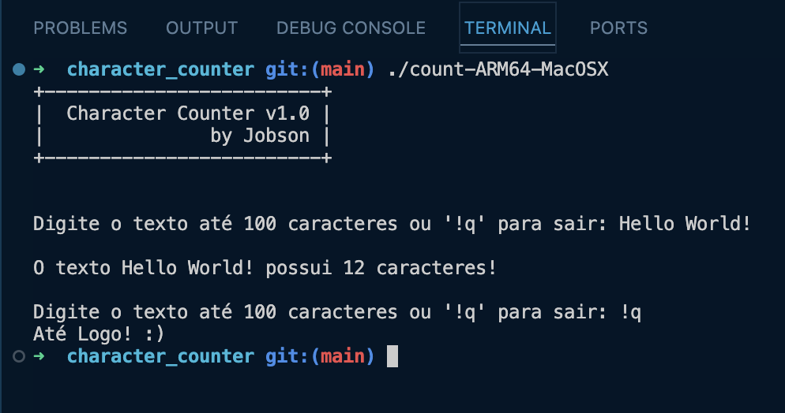

# Character Counter | Contador de Caracteres em C
### [PT] Contador de caracteres escrito em C // [EN] Character counter written in C



Este é um programa simples em C que conta o número de caracteres em uma linha de texto digitada pelo usuário.

## Como usar

1. Compile o programa usando um compilador C, como o GCC:

   ```
   gcc count.c -o count
   ```

2. Execute o programa:

   ```
   ./count
   ```

3. Digite uma linha de texto na entrada padrão (teclado).

4. Pressione Enter para enviar a linha de texto.

5. O programa contará o número de caracteres na linha e, se for "!q", sairá.

## Exemplo de saída

```
+-------------------------+
|  Character Counter v1.0 |
|               by Jobson |
+-------------------------+

Digite o texto até 100 caracteres ou '!q' para sair: Hello World!
O texto Hello World! possui 12 caracteres!

Digite o texto até 100 caracteres ou '!q' para sair:: !q
Você saiu do programa!
```

## Limitações

- O programa aceita apenas uma linha de texto por vez até 100 caracteres.
- Não lida com a presença de espaços extras no início ou no final da linha de texto.

---

Sinta-se à vontade para ajustar este README conforme necessário para refletir melhor o seu programa e as informações que deseja fornecer aos usuários.
